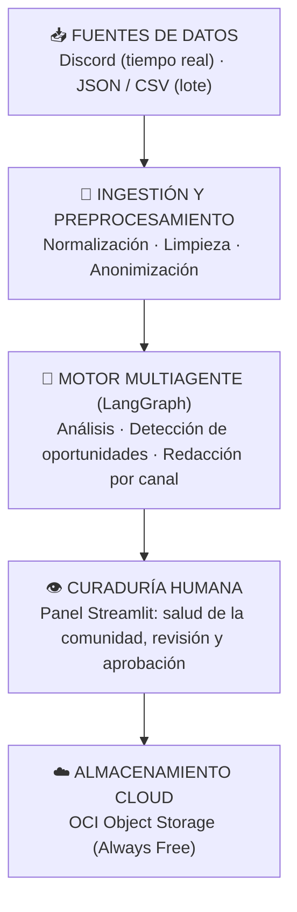

# 🧪 CommunityLab AI

**Sistema Multiagente de Inteligencia y Transformación de Comunidades Digitales**

Solución impulsada por IA que transforma las conversaciones no estructuradas de una comunidad digital (Discord, foros, chats) en activos de contenido listos para publicar: posts de LinkedIn, newsletters y FAQs educativas — con curaduría humana antes de cada publicación y almacenamiento trazable en Oracle Cloud Infrastructure.

> 🏆 Proyecto desarrollado para la **Hackathon ONE G10** — Oracle Next Education & Alura.
> *Track: MarTech & Community-Led Growth | Automatización con IA Generativa & Oracle Cloud Infrastructure (OCI)*

---

## 👥 Integrantes

| Integrante | Rol | LinkedIn |
|---|---|---|
| Carolhay Ttito | 📥 Ingesta de datos | *Pendiente* |
| Jhon Giraldo | 📥 Ingesta de datos | *Pendiente* |
| Gregory Morales | 🧠 IA / LLM | [linkedin.com/in/gregory-morales](https://www.linkedin.com/in/gregory-morales-50827428a/) |
| Axel Cañete | 🧠 IA / LLM | [py.linkedin.com/in/axel-cañete](https://py.linkedin.com/in/axel-ca%C3%B1ete-a95688299) |
| Anthony Uceda | 🖥️ Frontend (Streamlit) | [linkedin.com/in/anthony-frank-uceda-alfaro](https://www.linkedin.com/in/anthony-frank-uceda-alfaro-141b21394/) |
| Álvaro | 🖥️ Frontend (Streamlit) | *Pendiente* |
| Zurian | ☁️ Cloud / OCI | *Pendiente* |
| Celeste Box | 📥 Ingesta de datos | [linkedin.com/in/incbox](https://linkedin.com/in/incbox) |
| Hernan | *Por definir* | *Pendiente* |
| Juan | *Por definir* | *Pendiente* |

> ☁️ **Nota sobre OCI:** Zurian lidera la integración con Oracle Cloud, con apoyo de todo el equipo — es la etapa final del proyecto (la interfaz de guardado ya está congelada para conectarla sin cambios en el resto del sistema).

---

## 📌 El problema

Las comunidades digitales activas generan cientos de interacciones diarias. Entre ese volumen conviven testimonios valiosos, casos de éxito, dudas recurrentes y feedback crítico que se pierden en el historial de los canales, porque revisarlos y transformarlos manualmente en contenido consume horas de los equipos de Community Management y Marketing.

| Problema | Impacto | Solución CommunityLab AI |
|---|---|---|
| Volumen abrumador | Cientos de mensajes diarios imposibles de monitorear | Ingestión y procesamiento automático en lote (CSV/JSON) o tiempo real (Discord API) |
| Pérdida de valor | Casos de éxito y FAQs quedan "enterrados" en los canales | Agentes de IA dedicados a la clasificación semántica y detección de oportunidades |
| Lentitud en redacción | Crear posts, guías y reportes toma horas semanales | Generación automatizada de borradores para LinkedIn, newsletter y FAQ |
| Falta de trazabilidad | Imposible asociar un activo publicado con su conversación de origen | Mapeo relacional estricto: Contenido → Oportunidad → Mensaje original |

---


## 📌 Visión general

**CommunityLab AI** transforma las conversaciones de una comunidad digital en activos de marketing multiformato: posts de LinkedIn, destacados del newsletter semanal y FAQs para mentorías.

Un motor multiagente analiza el sentimiento y los temas de cada mensaje, detecta las oportunidades de contenido con un *Opportunity Score* y redacta borradores adaptados a cada canal. Nada se publica sin pasar por el panel de curaduría humana (**Human-in-the-Loop**), y cada paquete de activos queda persistido de forma trazable en **OCI Object Storage** (capa Always Free).

Los contratos de datos entre módulos están definidos en [`spec.md`](spec.md).

---

## 🏗️ Arquitectura



El proyecto sigue una arquitectura por capas: la interfaz no conoce los detalles de las fuentes, los agentes de IA son independientes de la presentación y la nube puede cambiarse sin romper el dominio.

```text
G10_LATAM_TEAM_26/
├── data/          # Fixtures de prueba, capturas y paquetes generados
├── src/
│   ├── domain/    # Contratos de datos (Pydantic)
│   ├── adapters/  # Ingesta, proveedores de IA y almacenamiento en la nube
│   ├── core/      # Motor multiagente (grafo LangGraph)
│   ├── ui/        # Panel de curaduría (Streamlit)
│   └── utils/     # Anonimización, texto y logs
├── tests/         # Pruebas con pytest
├── run_app.py     # Punto de entrada del panel
└── spec.md        # Contratos de datos entre módulos
```

---

## ✨ Funcionalidades

- **Ingesta** por lote (JSON o CSV) o en tiempo real desde Discord, con anonimización de datos personales.
- **Análisis con IA** de sentimiento, temas y tipo de cada mensaje.
- **Detección de oportunidades** de contenido: historias de éxito, logros y dudas frecuentes.
- **Generación de borradores** para LinkedIn, newsletter y FAQ, con el tono de cada canal.
- **Salud de la comunidad:** sentimiento general, temas principales, tendencias y mensajes que necesitan apoyo.
- **Curaduría:** editar, regenerar con indicaciones, aprobar o descartar cada borrador.
- **Trazabilidad:** cada activo conserva la referencia al mensaje que lo originó.

```
POST-034 (LinkedIn)  →  OPP-021 (Oportunidad)  →  MSG-8921 (#logros / Discord)
```

---

## ☁️ Almacenamiento en OCI

Los paquetes de activos se guardan en **OCI Object Storage (capa Always Free)**, organizados por etapa y fecha:

```
communitylab-bucket/
├── raw/YYYY-MM-DD/        # Datos tal como llegaron
├── processed/YYYY-MM-DD/  # Datos limpios y analizados
├── generated/YYYY-MM-DD/  # Paquetes de activos generados
└── reports/YYYY-MM-DD/    # Reportes de salud comunitaria
```

---

## 🛠️ Stack tecnológico

| Componente | Tecnología |
|---|---|
| Lenguaje | Python 3.11+ |
| Modelos de lenguaje | Google Gemini y Groq |
| Orquestación de agentes | LangGraph + LangChain |
| Interfaz y curaduría | Streamlit |
| Almacenamiento | OCI Object Storage (Always Free) |
| Validación de datos | Pydantic |
| Ingesta en tiempo real | Discord Bot API |
| Pruebas y despliegue local | pytest · Docker |

---

## 🚀 Instalación y uso

```bash
# 1. Clonar el repositorio
git clone https://github.com/No-Country-simulation/G10_LATAM_TEAM_26.git
cd G10_LATAM_TEAM_26

# 2. Crear entorno virtual e instalar dependencias
python -m venv .venv
source .venv/bin/activate        # En Windows: .venv\Scripts\activate
pip install -r requirements.txt

# 3. Configurar credenciales (API keys de IA y acceso al panel)
cp .env.example .env

# 4. Levantar el panel de curaduría (http://localhost:8501)
streamlit run run_app.py
```

Otras formas de ejecutarlo:

```bash
# Procesar un lote por línea de comandos (--simulado funciona sin API keys)
python -m src.cli data/fixtures/lote_ejemplo_formato_a.json --simulado

# Panel con Docker (http://localhost:8510)
docker compose up --build

# Pruebas
python -m pytest -q
```

---

## 🎬 Casos de demostración

**Caso 1 — Historia de éxito** · Origen: Discord `#logros`
> *"¡Comunidad, logré mi primer trabajo como Data Analyst gracias al bootcamp!"*
→ Se detecta como historia de éxito y genera un post de LinkedIn y un destacado para el newsletter, sin datos personales.

**Caso 2 — Pregunta recurrente (FAQ)** · Origen: Discord `#dudas-tecnicas`
> *"¿Alguien sabe cómo configurar los reintentos automáticos en LangGraph?"*
→ Se detecta como duda de interés general y genera una entrada de FAQ con tono didáctico.

**Caso 3 — Tendencia de comunidad** · Origen: lote CSV, múltiples usuarios
> Incremento de consultas sobre la API de Oracle en 48 horas
→ El sistema detecta el patrón en la salud de la comunidad y lo resume para los administradores *(en desarrollo)*.

---

## 🗓️ Roadmap

| Semana | Hito | Estado |
|---|---|---|
| 1 | Fundación: repositorio, dataset, formatos de datos y esqueleto end-to-end | ✅ Hecho |
| 2 | Inteligencia: prompts, cadena de agentes y scoring — casos 1 y 2 funcionando | ✅ Hecho |
| 3 | Producto completo: panel integrado con OCI, flujo de curaduría y diferenciales | 🟡 En curso |
| 4 | Validación: métricas, video demo y presentación final | ⏳ Pendiente |

---

## 📄 Licencia

Proyecto educativo desarrollado en el marco del programa **Oracle Next Education (ONE)** — Grupo 10, en colaboración con **Alura Latam**. Uso exclusivo de recursos de la capa Always Free de OCI, en conformidad con la gratuidad integral del programa.
