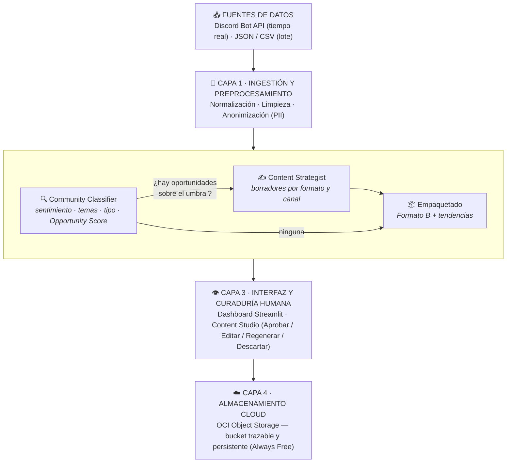

# 🧪 CommunityLab AI

**Sistema Multiagente de Inteligencia y Transformación de Comunidades Digitales**

Solución impulsada por IA que transforma las conversaciones no estructuradas de una comunidad digital (Discord, foros, chats) en activos de contenido listos para publicar: posts de LinkedIn, newsletters y FAQs educativas — con curaduría humana antes de cada publicación y almacenamiento trazable en Oracle Cloud Infrastructure.

> 🏆 Proyecto desarrollado para la **Hackathon ONE G10** — Oracle Next Education & Alura.
> *Track: MarTech & Community-Led Growth | Automatización con IA Generativa & Oracle Cloud Infrastructure (OCI)*

---

## 👥 Integrantes

| Integrante | Rol | LinkedIn |
|---|---|---|
| Carolhay Ttito | 📥 Ingesta de datos | *Pendiente* |
| Jhon Giraldo | 📥 Ingesta de datos | *Pendiente* |
| Gregory Morales | 🧠 IA / LLM | [linkedin.com/in/gregory-morales](https://www.linkedin.com/in/gregory-morales-50827428a/) |
| Axel Cañete | 🧠 IA / LLM | [py.linkedin.com/in/axel-cañete](https://py.linkedin.com/in/axel-ca%C3%B1ete-a95688299) |
| Anthony Uceda | 🖥️ Frontend (Streamlit) | [linkedin.com/in/anthony-frank-uceda-alfaro](https://www.linkedin.com/in/anthony-frank-uceda-alfaro-141b21394/) |
| Álvaro | 🖥️ Frontend (Streamlit) | *Pendiente* |
| Zurian | ☁️ Cloud / OCI | *Pendiente* |
| Celeste Box | 📥 Ingesta de datos | [linkedin.com/in/incbox](https://linkedin.com/in/incbox) |
| Hernan | *Por definir* | *Pendiente* |
| Juan | *Por definir* | *Pendiente* |

> ☁️ **Nota sobre OCI:** Zurian lidera la integración con Oracle Cloud, con apoyo de todo el equipo — es la etapa final del proyecto (la interfaz de guardado ya está congelada para conectarla sin cambios en el resto del sistema).

---

## 📌 El problema

Las comunidades digitales activas generan cientos de interacciones diarias. Entre ese volumen conviven testimonios valiosos, casos de éxito, dudas recurrentes y feedback crítico que se pierden en el historial de los canales, porque revisarlos y transformarlos manualmente en contenido consume horas de los equipos de Community Management y Marketing.

| Problema | Impacto | Solución CommunityLab AI |
|---|---|---|
| Volumen abrumador | Cientos de mensajes diarios imposibles de monitorear | Ingestión y procesamiento automático en lote (CSV/JSON) o tiempo real (Discord API) |
| Pérdida de valor | Casos de éxito y FAQs quedan "enterrados" en los canales | Agentes de IA dedicados a la clasificación semántica y detección de oportunidades |
| Lentitud en redacción | Crear posts, guías y reportes toma horas semanales | Generación automatizada de borradores para LinkedIn, newsletter y FAQ |
| Falta de trazabilidad | Imposible asociar un activo publicado con su conversación de origen | Mapeo relacional estricto: Contenido → Oportunidad → Mensaje original |

---

## 📌 Visión general

**CommunityLab AI** automatiza la extracción, el análisis y la transformación de conversaciones de comunidades digitales (Discord) en activos de marketing multiformato: posts de LinkedIn, destacados del newsletter semanal y FAQs para mentorías.

Cada mensaje se clasifica y recibe un **Opportunity Score**; solo los que superan el umbral de su tipo se convierten en borradores. Nada se publica sin pasar por el panel de curaduría humana (**Human-in-the-Loop**), y cada paquete queda persistido de forma trazable para **OCI Object Storage** (capa Always Free).

Los contratos de datos entre módulos (Formatos A, P y B) están definidos en [`spec.md`](spec.md).

---

## 🏛️ Arquitectura de carpetas (Clean Architecture)

El proyecto sigue una arquitectura desacoplada: la interfaz no conoce detalles de Discord, los agentes de IA son independientes de la presentación y la nube puede cambiarse sin romper el dominio.

```text
G10_LATAM_TEAM_26/
├── data/
│   ├── raw/                 # Capa Bronze: capturas del bot de Discord (YYYY-MM-DD/discord_capturas.jsonl)
│   ├── fixtures/            # Mocks oficiales del spec: lote Formato A, procesados Formato P, paquete Formato B
│   ├── config/              # Topología de servidores y canales observados por el bot
│   └── processed/           # Capa Gold: paquetes Formato B guardados por el panel (generated/YYYY-MM-DD/)
├── src/
│   ├── domain/
│   │   └── schemas.py       # Contratos Pydantic de los Formatos A y B (fuente única de verdad)
│   ├── utils/
│   │   ├── sanitizer.py     # Anonimización de PII: correos, teléfonos, menciones y autores
│   │   ├── texto.py         # Normalización de texto del LLM, hashtags, lotes y pasos numerados
│   │   └── logger.py        # Logger estructurado en JSON
│   ├── adapters/            # Conectores externos (infraestructura de entrada y salida)
│   │   ├── ingestion/
│   │   │   ├── discord_bot.py   # Bot de Discord en vivo con backfill de historial
│   │   │   └── loaders.py       # Lotes JSON, CSV y capturas de Discord → Formato A
│   │   ├── llm/
│   │   │   └── proveedores.py   # Gemini / Groq: reintentos por cuota, respaldo automático y lotes en paralelo
│   │   ├── cloud/
│   │   │   └── oci_storage.py   # Persistencia del paquete Formato B (hoy local; subida al bucket en curso)
│   │   └── salidas.py           # Paquete JSON y cuadro CSV en salidas/ (uso por línea de comandos)
│   ├── core/                # Motor LangGraph
│   │   ├── agents/
│   │   │   ├── classifier.py    # Clasificación compacta: análisis + tipo + score en una llamada por lote
│   │   │   ├── analyst.py       # Modo completo: sentimiento, temas e intención
│   │   │   ├── detector.py      # Modo completo: tipo y Opportunity Score; umbrales por tipo
│   │   │   ├── strategist.py    # Redacción de borradores por formato y regeneración con indicaciones
│   │   │   ├── esquemas_llm.py  # Esquemas de salida estructurada de la IA
│   │   │   └── simulado.py      # Heurísticas sin IA para desarrollo y tests
│   │   ├── prompts.py       # Prompt de clasificación y uno de redacción por formato
│   │   ├── orchestrator.py  # Grafos y API pública: procesar(), clasificar(), generar_contenido()
│   │   ├── generacion.py    # Redacción en segundo plano mientras el panel ya muestra la clasificación
│   │   ├── packager.py      # Formato B (paquete), Formato P (análisis por mensaje) y tendencias
│   │   └── estado.py        # Estado compartido del grafo
│   ├── ui/                  # Interfaz Streamlit
│   │   ├── styles.py        # Estilos CSS (Dark / Light)
│   │   ├── components/      # Tarjetas KPI y previsualizador de LinkedIn
│   │   └── views/           # dashboard, explorer (Detección & Scoring), studio (curaduría) y oci_view
│   ├── config.py            # Modelos, umbrales, tamaños de lote y concurrencia (sobreescribibles por .env)
│   └── cli.py               # python -m src.cli lote.json [--simulado]
├── tests/unit/              # pytest: sanitizador, umbrales, hashtags y contrato del Formato B
├── docs/                    # Documentación adicional
├── run_app.py               # Punto de entrada del panel (login y navegación)
├── spec.md                  # Contratos de datos A, P y B
├── Dockerfile               # Imagen del panel (python:3.11-slim)
└── docker-compose.yml       # Panel en http://localhost:8510 con el código montado en caliente
```

---

## 🏗️ Arquitectura



### Arquitectura multiagente

El motor es un grafo de **LangGraph** con dos etapas que el panel ejecuta por separado: primero la **clasificación** (visible en segundos) y luego la **redacción**, que corre en segundo plano y va entregando borradores a medida que están listos.

| Nodo | Entrada | Función | Salida |
|---|---|---|---|
| **Community Classifier** | Lote de mensajes anonimizados | En una llamada por lote: sentimiento, 1 a 3 temas y tipo de cada mensaje; score y razón solo para los candidatos a contenido | Formato P por mensaje |
| **Content Strategist** | Oportunidades + mensaje original | Redacta cada pieza con el prompt propio de su formato (LinkedIn, newsletter o FAQ) | Borradores en estado `borrador` |
| **Empaquetado** | Estado completo del grafo | Resumen de la comunidad, tendencias por agregación y activos autocontenidos | Paquete Formato B |

**Modo completo (opcional):** con `LLM_CLASIFICACION=completa`, la clasificación se divide en dos nodos, **Community Analyst** (sentimiento, temas e intención) y **Opportunity Detector** (tipo, score y razón para cada mensaje). Es más lento y no mejora la detección en las pruebas con 50 mensajes, por lo que el modo compacto es el predeterminado.

**Taxonomía de tipos:**

| Tipo | Qué es |
|---|---|
| `SUCCESS_STORY` | El autor consiguió trabajo, fue seleccionado o hizo una transición profesional |
| `MILESTONE` | El autor terminó un curso, certificación o proyecto destacable |
| `FAQ` | Duda técnica o conceptual con contexto suficiente, útil para muchos miembros |
| `OPERATIONAL_QUERY` | Duda logística sobre clases, links, horarios o la plataforma (no genera contenido público) |
| `FEEDBACK` | Opinión, sugerencia o crítica sobre cursos, clases, mentorías o la plataforma (no genera contenido público) |
| `NONE` | Charla social, memes, felicitaciones, anuncios o preguntas sin contexto |

### Algoritmo de priorización (Opportunity Score)

Cada candidato recibe un **Opportunity Score** (0.00 – 1.00) que mide claridad, relevancia para la comunidad y potencial inspirador o educativo, usando reacciones y respuestas como señales adicionales. El umbral lo aplica el código, no el modelo:

| Tipo | Umbral | Borradores generados |
|---|---|---|
| `SUCCESS_STORY` | ≥ 0.80 | Post de LinkedIn + destacado del newsletter |
| `MILESTONE` | ≥ 0.80 | Post de LinkedIn |
| `FAQ` | ≥ 0.70 | Entrada de la base de preguntas frecuentes |
| `OPERATIONAL_QUERY` · `FEEDBACK` · `NONE` | — | Solo analítica; no generan borrador |

Las consultas operativas y el feedback se cuentan en el resumen del paquete (`consultas_operativas` y `feedback_recibido`) y se muestran en el panel como información para el equipo del programa, con un filtro propio para revisar el feedback. Nunca se convierten en contenido público.

### Resiliencia

- **Cadena de modelos:** Gemini `gemini-3.5-flash-lite` → `gemini-3-flash-preview` → `gemini-2.5-flash` → Groq. Cada modelo de Gemini tiene su propia cuota con la misma key; ante un error, la llamada pasa al siguiente sin esperar.
- **Cobertura en la clasificación:** si un modelo no responde en 10 s, se lanza el siguiente en paralelo y gana la primera respuesta (*hedged requests*).
- **Caché por mensaje:** reprocesar un lote, o mensajes ya vistos, no vuelve a llamar a la IA.
- **Clasificación progresiva:** lotes de 10 mensajes; el panel muestra cada lote apenas responde y la redacción sigue en segundo plano.
- **Reintentos por cuota:** el último modelo de la cadena reintenta hasta 3 veces ante errores 429/503, con espera creciente.
- **Lotes en paralelo:** hasta 3 lotes simultáneos para no superar los límites por minuto de las capas gratuitas.
- **Fallos parciales:** un lote que falla no detiene al resto; sus piezas quedan como pendientes y el paquete se marca `parcial`.

---

## 🔗 Modelo de datos y trazabilidad

Los tres formatos de [`spec.md`](spec.md) conectan los módulos:

```
[Ingesta] ──Formato A──> [Motor LangGraph] ──Formato B──> [OCI Storage] ──> [Panel Streamlit]
                                │
                      Formato P (análisis por mensaje)
```

**Formato P** — resultado del análisis de cada mensaje:

```json
{
  "tracking": {
    "message_id": "MSG-8921",
    "source": "discord",
    "channel": "logros",
    "timestamp": "2026-09-17T15:30:00Z"
  },
  "analysis": {
    "sentiment": "positive",
    "topics": ["empleo", "data analysis"],
    "intent": "compartir_logro"
  },
  "opportunity": {
    "type": "SUCCESS_STORY",
    "opportunity_score": 0.94,
    "reason": "Reporta su contratación como Data Analyst con detalles concretos."
  }
}
```

**Formato B** — cada activo del paquete es **autocontenido**: su campo `origen` incluye el mensaje original, el tipo, el score y la razón, de modo que el panel no necesita buscar en otro archivo. Todo activo nace en estado `borrador`; solo el panel lo cambia a `aprobado`, `publicado` o `descartado`.

```
POST-034 (LinkedIn)  →  OPP-021 (Oportunidad)  →  MSG-8921 (#logros / Discord)
```

---

## ☁️ Estructura de almacenamiento en OCI

El almacenamiento usa **OCI Object Storage (capa Always Free)** con la convención de rutas del spec:

```
communitylab-bucket/
├── raw/YYYY-MM-DD/          # Lote tal como llegó (pre-Formato A)
├── processed/YYYY-MM-DD/    # Lote en Formato A + objetos en Formato P
├── generated/YYYY-MM-DD/    # Paquete completo en Formato B (<paquete_id>.json)
└── reports/YYYY-MM-DD/      # Consolidados de salud comunitaria
```

> **Estado actual:** el panel valida el paquete contra el Formato B y lo guarda en `data/processed/generated/YYYY-MM-DD/<paquete_id>.json` con la misma ruta que tendrá en el bucket (status `guardado_local`). La subida real al bucket se conecta en `src/adapters/cloud/oci_storage.py` sin cambios en el resto del sistema.

---

## 🛠️ Stack tecnológico

| Componente | Tecnología |
|---|---|
| Lenguaje | Python 3.11+ |
| Modelo de lenguaje (LLM) | Google Gemini `gemini-3.5-flash-lite` (titular) · Groq `openai/gpt-oss-120b` (respaldo) |
| Orquestación de agentes | LangGraph + LangChain (salida estructurada) |
| Interfaz y curaduría | Streamlit |
| Almacenamiento | OCI Object Storage (Always Free) |
| Validación de datos | Pydantic |
| Ingesta en tiempo real (diferencial) | Discord Bot API (`discord.py`) |
| Pruebas | pytest |
| Despliegue local | Docker / Docker Compose |

---

## 🚀 Instalación y uso

```bash
# 1. Clonar el repositorio
git clone https://github.com/No-Country-simulation/G10_LATAM_TEAM_26.git
cd G10_LATAM_TEAM_26

# 2. Crear entorno virtual e instalar dependencias
python -m venv .venv
source .venv/bin/activate        # En Windows: .venv\Scripts\activate
pip install -r requirements.txt

# 3. Configurar credenciales
cp .env.example .env             # y completar las claves (ver tabla abajo)

# 4. Levantar el panel de curaduría (http://localhost:8501)
streamlit run run_app.py
```

**Otras formas de ejecutarlo:**

```bash
# Procesar un lote por línea de comandos (resultado en salidas/)
python -m src.cli data/fixtures/lote_ejemplo_formato_a.json

# Sin claves de API: heurísticas locales en lugar del LLM
python -m src.cli data/fixtures/lote_ejemplo_formato_a.json --simulado

# Panel con Docker (http://localhost:8510)
docker compose up --build

# Bot de Discord (capturas en data/raw/)
python -m src.adapters.ingestion.discord_bot

# Pruebas
python -m pytest -q
```

### Variables de entorno

| Variable | Uso | Valor por defecto |
|---|---|---|
| `GEMINI_API_KEY` | Clave de Google AI Studio (proveedor titular) | — |
| `GROQ_API_KEY` | Clave de Groq (respaldo automático) | — |
| `ADMIN_USER` · `ADMIN_PASSWORD` | Acceso al panel | `admin` · definida en `.env` |
| `DISCORD_BOT_TOKEN` | Token del bot de Discord | — |
| `LLM_PROVIDER` | Proveedor titular: `gemini` o `groq` | `gemini` |
| `LLM_CLASIFICACION` | `compacta` (una llamada por lote) o `completa` (analista + detector) | `compacta` |
| `LLM_TAMANO_LOTE` · `LLM_TAMANO_LOTE_CONTENIDO` | Mensajes por llamada de clasificación · piezas por llamada de redacción | `10` · `4` |
| `LLM_CONCURRENCIA` | Lotes simultáneos | `3` |
| `LLM_GEMINI_ALTERNOS` | Modelos de Gemini que se prueban antes de Groq (misma key, cuota propia por modelo) | `gemini-3-flash-preview,gemini-2.5-flash` |
| `LLM_COBERTURA_S` | Segundos sin respuesta antes de lanzar el siguiente modelo en paralelo al clasificar (`0` la desactiva) | `10` |
| `LLM_RAZONAMIENTO_GROQ` | Esfuerzo de razonamiento de gpt-oss al clasificar | `low` |
| `LLM_CACHE` | Reutiliza la clasificación de mensajes ya procesados con el mismo prompt (`data/cache/`) | `1` |
| `LLM_ESPERA_BASE` | Segundos de espera base entre reintentos por cuota del último modelo de la cadena | `30` |
| `OCI_BUCKET_NAME` · `OCI_NAMESPACE` | Destino en Object Storage | `communitylab-bucket` |

---

## 🎬 Casos de demostración

**Caso 1 — Historia de éxito** · Origen: Discord `#logros`
> *"¡Comunidad, logré mi primer trabajo como Data Analyst gracias al bootcamp!"*
→ Se clasifica como `SUCCESS_STORY` con score alto y genera un post de LinkedIn (apertura llamativa, párrafos cortos, cita literal del miembro y cierre que interpela al lector) más un destacado para el newsletter. Ninguno incluye nombres ni asume el género del autor.

**Caso 2 — Pregunta recurrente (FAQ)** · Origen: Discord `#dudas-tecnicas`
> *"¿Alguien sabe cómo configurar los reintentos automáticos en LangGraph?"*
→ Se clasifica como `FAQ` y genera una entrada con tono de mentor y pasos numerados. Si la respuesta requiere datos internos del programa, deja un `[COMPLETAR: ...]` en lugar de inventarlos.

**Caso 3 — Tendencia de comunidad** · Origen: lote CSV, múltiples usuarios
> Incremento inusual de consultas sobre la API de Oracle en 48 horas
→ El empaquetado detecta por agregación los temas con varias menciones y los muestra en el panel con su desglose por tipo. El resumen ejecutivo para administradores está en desarrollo.

---

## 🗓️ Roadmap

| Semana | Hito | Estado |
|---|---|---|
| 1 | Fundación: repositorio, dataset, formatos de datos, esqueleto end-to-end con bucket OCI activo | ✅ Hecho, salvo el bucket OCI (guardado local con la misma ruta) |
| 2 | Inteligencia: prompts estructurados, cadena de agentes, scoring — casos 1 y 2 funcionando | ✅ Hecho |
| 3 | Producto completo: panel Streamlit integrado con OCI, flujo de curaduría, diferenciales | 🟡 Curaduría y redacción en segundo plano listas; falta la subida a OCI y la acción de publicar |
| 4 | Validación: métricas de clasificación, video demo, presentación final | ⏳ Pendiente |

---

## 📄 Licencia

Proyecto educativo desarrollado en el marco del programa **Oracle Next Education (ONE)** — Grupo 10, en colaboración con **Alura Latam**. Uso exclusivo de recursos de la capa Always Free de OCI, en conformidad con la gratuidad integral del programa.
