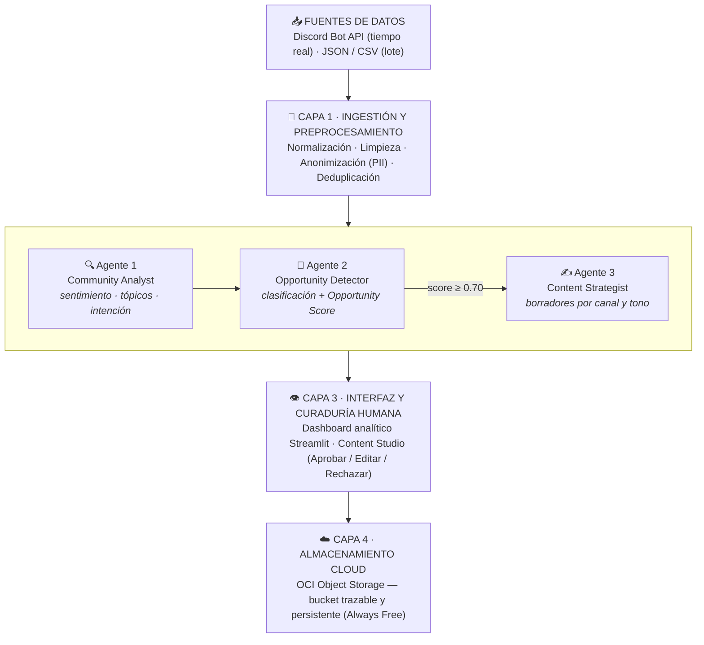

# 🧪 CommunityLab AI

**Sistema Multiagente de Inteligencia y Transformación de Comunidades Digitales**

Solución impulsada por IA que transforma las conversaciones no estructuradas de una comunidad digital (Discord, foros, chats) en activos de contenido listos para publicar: posts de LinkedIn, newsletters y FAQs educativas — con curaduría humana antes de cada publicación y almacenamiento trazable en Oracle Cloud Infrastructure.

> 🏆 Proyecto desarrollado para la **Hackathon ONE G10** — Oracle Next Education & Alura.

---

## 👥 Integrantes

| Integrante | Rol | LinkedIn |
|---|---|---|
| Celeste Box | *Por definir* | [linkedin.com/in/incbox](https://linkedin.com/in/incbox) |
| Gregory Morales | *Por definir* | [linkedin.com/in/gregory-morales](https://www.linkedin.com/in/gregory-morales-50827428a/) |
| Anthony Uceda | *Por definir* | [linkedin.com/in/anthony-frank-uceda-alfaro](https://www.linkedin.com/in/anthony-frank-uceda-alfaro-141b21394/) |
| Carolhay Ttito | *Por definir* | *Pendiente* |
| Jhon Giraldo | *Por definir* | *Pendiente* |
| Hernan | *Por definir* | *Pendiente* |
| Axel Cañete | *Por definir* | [py.linkedin.com/in/axel-cañete](https://py.linkedin.com/in/axel-ca%C3%B1ete-a95688299) |
| Juan | *Por definir* | *Pendiente* |

---

## 📌 El problema

Las comunidades digitales activas generan cientos de interacciones diarias. Entre ese volumen conviven testimonios valiosos, casos de éxito, dudas recurrentes y feedback crítico que se pierden en el historial de los canales, porque revisarlos y transformarlos manualmente en contenido consume horas de los equipos de Community Management y Marketing.

| Problema | Impacto | Solución CommunityLab AI |
|---|---|---|
| Volumen abrumador | Cientos de mensajes diarios imposibles de monitorear | Ingestión y procesamiento automático en lote (CSV/JSON) o tiempo real (Discord API) |
| Pérdida de valor | Casos de éxito y FAQs quedan "enterrados" en los canales | Agentes de IA dedicados a la clasificación semántica y detección de oportunidades |
| Lentitud en redacción | Crear posts, guías y reportes toma horas semanales | Generación automatizada de borradores para LinkedIn, newsletter y FAQ |
| Falta de trazabilidad | Imposible asociar un activo publicado con su conversación de origen | Mapeo relacional estricto: Contenido → Oportunidad → Mensaje original |

---

## 🏗️ Arquitectura

El sistema adopta una arquitectura por capas modulares que separa fuentes de entrada, inteligencia multiagente, interfaz de curaduría y almacenamiento cloud:



### Arquitectura multiagente

En lugar de una única consulta masiva al LLM, el razonamiento se divide en **tres agentes especializados en cadena**:

| Agente | Entrada | Función | Salida |
|---|---|---|---|
| **Community Analyst** | Mensaje limpio | Extrae sentimiento, temas principales e intención | Metadata de análisis semántico |
| **Opportunity Detector** | Mensaje + metadata | Clasifica el tipo de oportunidad y calcula el *Opportunity Score* | `SUCCESS_STORY` · `FAQ` · `TREND` · `FEEDBACK` · `MILESTONE` · `NONE` |
| **Content Strategist** | Oportunidad + contexto original | Adapta el contenido al formato y tono del canal objetivo | Borradores para LinkedIn, Newsletter o FAQ educativa |

### Algoritmo de priorización (Opportunity Score)

Para filtrar el ruido y no saturar al equipo editorial, cada interacción recibe un **Community Opportunity Score** (0.00 – 1.00) que pondera relevancia, engagement, sentimiento y novedad:

| Score | Clasificación | Acción automática |
|---|---|---|
| 0.90 – 1.00 | 🔴 Alta prioridad | Generación inmediata de activos multicanal (LinkedIn + Newsletter) y notificación en el panel |
| 0.70 – 0.89 | 🟡 Media prioridad | Generación de borrador único específico (FAQ educativa o tip de comunidad) |
| 0.00 – 0.69 | ⚪ Baja prioridad | Registro para analítica global; no genera borrador |

---

## 🔗 Modelo de datos y trazabilidad

Todos los mensajes adoptan una estructura JSON unificada que garantiza trazabilidad total desde el activo publicado hasta la interacción original:

```json
{
  "tracking": {
    "message_id": "MSG-8921",
    "source": "discord",
    "channel": "logros",
    "timestamp": "2026-09-17T15:30:00Z"
  },
  "analysis": {
    "sentiment": "positive",
    "topics": ["empleo", "data_analysis"],
    "relevance_score": 0.95
  },
  "opportunity": {
    "type": "SUCCESS_STORY",
    "opportunity_score": 0.94,
    "reason": "El usuario reporta su contratación exitosa como Data Analyst."
  }
}
```

**Esquema de lineage:** cada publicación aprobada conserva la referencia exacta del mensaje que la inspiró:

```
POST-034 (LinkedIn)  →  OPP-021 (Oportunidad)  →  MSG-8921 (#logros / Discord)
```

---

## ☁️ Estructura de almacenamiento en OCI

El almacenamiento utiliza **OCI Object Storage (capa Always Free)** con la siguiente organización dentro del bucket:

```
communitylab-bucket/
├── raw/           # Mensajes en bruto recibidos (JSON/CSV)
│   └── YYYY-MM-DD/
├── processed/     # Mensajes limpios y analizados semánticamente
│   └── YYYY-MM-DD/
├── generated/     # Activos de contenido aprobados
│   ├── linkedin/
│   ├── newsletter/
│   └── faq/
└── reports/       # Reportes consolidados de salud comunitaria
    └── YYYY-MM-DD/
```

---

## 🛠️ Stack tecnológico

| Componente | Tecnología |
|---|---|
| Lenguaje | Python 3.11+ |
| Modelo de lenguaje (LLM) | *Por definir: Google Gemini / OpenAI / Anthropic Claude* |
| Orquestación de agentes | *Por definir: LangGraph / n8n* |
| Interfaz y curaduría | Streamlit |
| Almacenamiento | OCI Object Storage (Always Free) |
| Validación de datos | Pydantic |
| Ingesta en tiempo real (diferencial) | Discord Bot API |

---

## 🚀 Instalación y despliegue

> ⚠️ Sección en construcción — se completará durante el desarrollo.

```bash
# 1. Clonar el repositorio
git clone https://github.com/No-Country-simulation/G10_LATAM_TEAM_26.git
cd G10_LATAM_TEAM_26

# 2. Crear entorno virtual e instalar dependencias
python -m venv .venv
source .venv/bin/activate        # En Windows: .venv\Scripts\activate
pip install -r requirements.txt

# 3. Configurar credenciales
cp .env.example .env
# Editar .env con: API key del LLM + credenciales de OCI

# 4. Ejecutar el pipeline sobre el dataset de ejemplo
python -m pipeline.procesar data/ejemplo_interacciones.json

# 5. Levantar el panel de curaduría
streamlit run app.py
```

---

## 🎬 Casos de demostración

**Caso 1 — Historia de éxito** · Origen: Discord `#logros`
> *"¡Comunidad, logré mi primer trabajo como Data Analyst gracias al bootcamp!"*
→ El sistema detecta alta relevancia y genera un post de LinkedIn con gancho, cuerpo, llamado a la acción y hashtags.

**Caso 2 — Pregunta recurrente (FAQ)** · Origen: Discord `#dudas-tecnicas`
> *"¿Alguien sabe cómo configurar los reintentos automáticos en LangGraph?"*
→ Se clasifica como consulta técnica de alto interés y genera una guía rápida / FAQ educativa.

**Caso 3 — Tendencia de comunidad** · Origen: lote CSV, múltiples usuarios
> Incremento inusual de consultas sobre la API de Oracle en 48 horas
→ El sistema detecta el patrón y genera un resumen ejecutivo para los administradores.

---

## 🗓️ Roadmap

| Semana | Hito |
|---|---|
| 1 | Fundación: repositorio, dataset, contratos de datos, esqueleto end-to-end con bucket OCI activo |
| 2 | Inteligencia: prompts estructurados, cadena de agentes, scoring — casos 1 y 2 funcionando |
| 3 | Producto completo: panel Streamlit integrado con OCI, flujo de curaduría, diferenciales |
| 4 | Validación: métricas de clasificación, video demo, presentación final |

---

## 📄 Licencia

Proyecto educativo desarrollado en el marco del programa **Oracle Next Education (ONE)** — Grupo 10, en colaboración con **Alura Latam**. Uso exclusivo de recursos de la capa Always Free de OCI, en conformidad con la gratuidad integral del programa.
